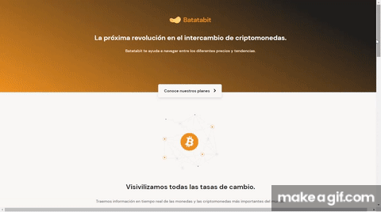

<h1 align="center">
  
   
</h1>

## Preview 🎬

  
   

 

## About 👀
**Bata-bit** te permite ver el precio en tiempo real de las criptomonedas y divisas mas relevantes del mercado, además, te permite comprar, intercambiar y/o vender tus criptomonedas sin preocuparte por tasas escondidas, solo necesitas adquirir una suscripción para unirte a nuestra gran comunidad y disfrutar de todos nuestros servicios.

Puedes ver el proyecto publicado  [Aquí](https://cristhian-medina.github.io/Bata-Bit/) 

> Este proyecto fue desarrollado en el curso de responsive design en Platzi, utilizando la metodologia de maquetación mobile first y las tecnologias CSS3, HTML5 y JavaScript. Los datos se obtienen desde una API _( exchangerate )_ utilizando Fetch API.
